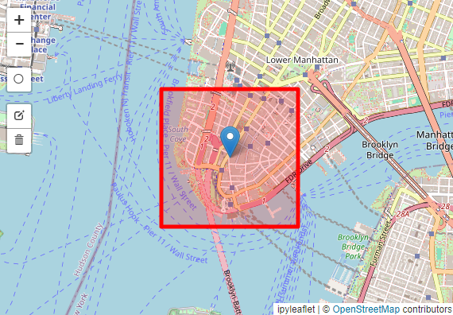
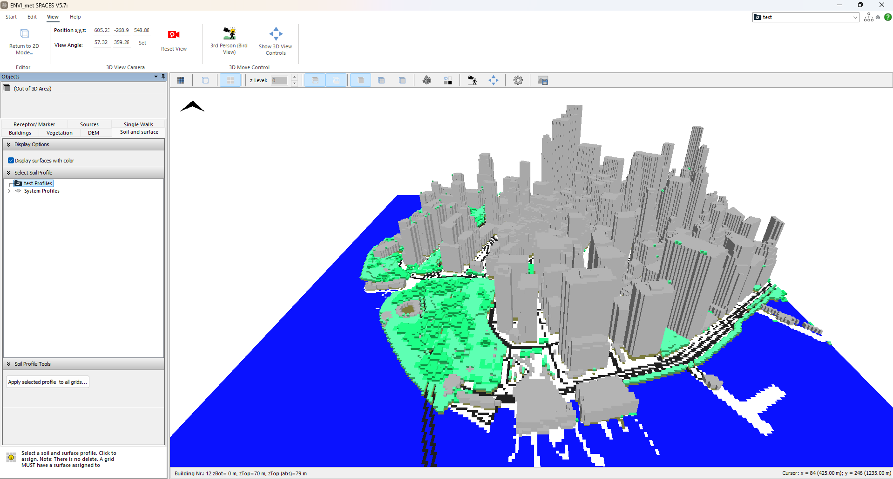
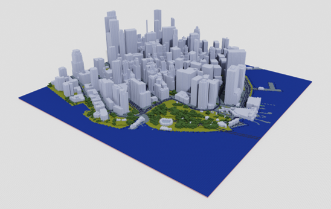
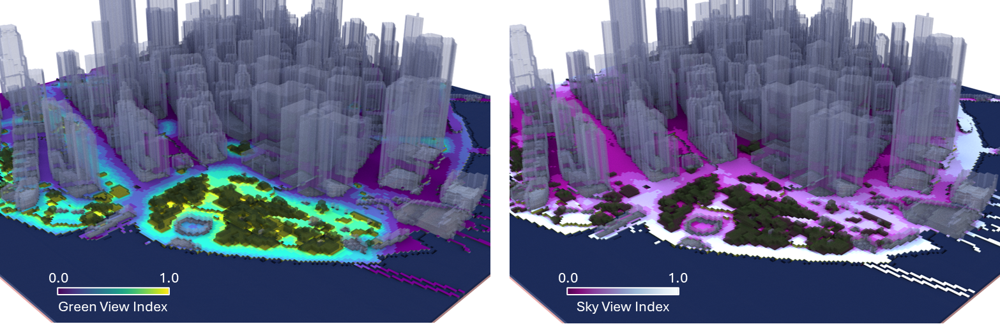
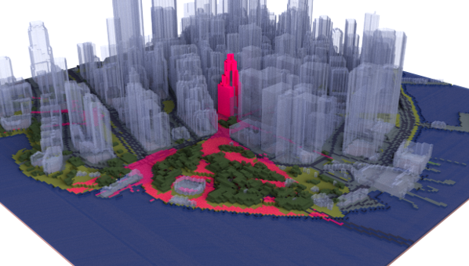

# VoxelCity

**VoxelCity** is a Python package that facilitates the creation of voxel-based 3D urban environments and related geospatial analyses. It integrates various geospatial datasets—such as building footprints, land cover, canopy height, and digital elevation models (DEMs)—to generate 2D and 3D representations of urban areas. It can export data in formats compatible with popular simulation tools like ENVI-MET, as well as visualization tools like MagicaVoxel, and supports simulations such as sky view index and green view index calculations.

## Key Features

- **Integration of Multiple Data Sources:**  
  Combines building footprints, land cover data, canopy height maps, and DEMs to generate a consistent 3D voxel representation of an urban scene.
  
- **Flexible Input Sources:**  
  Supports various building and terrain data sources including:
  - Building Footprints: OpenStreetMap, Overture, EUBUCCO, Microsoft Building Footprints, OpenMapTiles, Open Building 2.5D
  - Land Cover: UrbanWatch, OpenEarthMap Japan, ESA WorldCover, ESRI Land Cover, Dynamic World, OpenStreetMap
  - Canopy Height: High Resolution 1m Global Canopy Height Maps, ETH Global Sentinel-2 10m
  - DEM: DeltaDTM, FABDEM, NASA, COPERNICUS, and more
  
- **Customizable Domain and Resolution:**  
  Easily define a target area by drawing a rectangle on a map or specifying center coordinates and dimensions. Adjust the mesh size to meet resolution needs.
  
- **Integration with Earth Engine:**  
  Leverages Google Earth Engine for large-scale geospatial data processing (authentication and project setup required).
  
- **Output Formats:**
  - **ENVI-MET**: Export INX and EDB files suitable for ENVI-MET microclimate simulations.
  - **MagicaVoxel**: Export vox files for 3D editing and visualization in MagicaVoxel.
  - **OBJ**: Export wavefront OBJ for rendering and integration into other workflows.

- **Analytical Tools:**
  - **View Index Simulations**: Compute sky view index (SVI) and green view index (GVI) from a specified viewpoint.
  - **Landmark Visibility Maps**: Assess the visibility of selected landmarks within the voxelized environment.

## Installation

Make sure you have Python 3.7+ installed. Install VoxelCity with:

```bash
pip install voxelcity
```

You will also need to have Earth Engine authenticated if you plan to use Earth Engine datasets:

```bash
earthengine authenticate
```

## Setup for Earth Engine

To use Earth Engine data, set up your Earth Engine enabled Cloud Project by following the instructions here:
https://developers.google.com/earth-engine/cloud/earthengine_cloud_project_setup

After setting up, authenticate and initialize Earth Engine:

```python
import ee
ee.Authenticate()
ee.Initialize(project='your-project-id')
```

## Usage Overview

### 1. Prepare Environment

```python
# Install and authenticate Earth Engine (if needed)
!pip install voxelcity
!earthengine authenticate

import ee
ee.Authenticate()
ee.Initialize(project='your-project-id')
```

### 2. Define Target Area

You can define your target area in two ways:

#### Option 1: Draw a Rectangle
Use the GUI map interface to draw a rectangular domain of interest.

```python
from voxelcity.geo.draw import draw_rectangle_map_cityname

cityname = "tokyo"
m, rectangle_vertices = draw_rectangle_map_cityname(cityname, zoom=15)
m
```

#### Option 2: Specify Center and Dimensions
Choose the width and height in meters and select the center point on the map.

```python
from voxelcity.geo.draw import center_location_map_cityname

width = 500
height = 500
m, rectangle_vertices = center_location_map_cityname(cityname, width, height, zoom=15)
m
```
<p align="center">
  <picture>
    <source media="(prefers-color-scheme: dark)" srcset="images/draw_rect.png">
    
  </picture>
</p>

### 3. Set Parameters

Define data sources and mesh size:

```python
building_source = 'OpenStreetMap'
land_cover_source = 'OpenStreetMap'
canopy_height_source = 'High Resolution 1m Global Canopy Height Maps'
dem_source = 'DeltaDTM'
meshsize = 5

kwargs = {
    "output_dir": "output",
    "dem_interpolation": True
}
```

### 4. Get VoxelCity Output

Generate voxel data grids and corresponding building geoJSON:

```python
from voxelcity import get_voxelcity

voxelcity_grid, building_height_grid, building_min_height_grid, \
building_id_grid, canopy_height_grid, land_cover_grid, dem_grid, \
building_geojson = get_voxelcity(
    rectangle_vertices,
    building_source,
    land_cover_source,
    canopy_height_source,
    dem_source,
    meshsize,
    **kwargs
)
```

### 5. Exporting Files

#### ENVI-MET INX/EDB Files:

```python
from voxelcity.file.envimet import export_inx, generate_edb_file

envimet_kwargs = {
    "output_directory": "output",
    "author_name": "your name",
    "model_description": "generated with VoxelCity",
    "domain_building_max_height_ratio": 2,
    "useTelescoping_grid": True,
    "verticalStretch": 20,
    "min_grids_Z": 20,
    "lad": 1.0
}

export_inx(building_height_grid, building_id_grid, canopy_height_grid, land_cover_grid, dem_grid, meshsize, land_cover_source, rectangle_vertices, **envimet_kwargs)
generate_edb_file(**envimet_kwargs)
```
<p align="center">
  <picture>
    <source media="(prefers-color-scheme: dark)" srcset="images/envimet.png">
    
  </picture>
</p>

#### MagicaVoxel VOX Files:

```python
from voxelcity.file.magicavoxel import export_magicavoxel_vox

output_path = "output"
base_filename = "voxelcity"
export_magicavoxel_vox(voxelcity_grid, output_path, base_filename=base_filename)
```
<p align="center">
  <picture>
    <source media="(prefers-color-scheme: dark)" srcset="images/envimet.png">
    
  </picture>
</p>

#### OBJ Files:

```python
from voxelcity.file.obj import export_obj

output_directory = "output"
output_file_name = "voxcity"
export_obj(voxelcity_grid, output_directory, output_file_name, meshsize)
```
<p align="center">
  <picture>
    <source media="(prefers-color-scheme: dark)" srcset="images/obj.png">
    
  </picture>
</p>

### 6. Additional Use Cases

#### Compute Green View Index (GVI) and Sky View Index (SVI):

```python
from voxelcity.sim.view import get_green_view_index, get_sky_view_index

view_kwargs = {
    "view_point_height": 1.5,
    "dem_grid": dem_grid,
    "colormap": "viridis",
    "obj_export": True,
    "output_directory": "output",
    "output_file_name": "gvi"
}
gvi_grid = get_green_view_index(voxelcity_grid, meshsize, **view_kwargs)

view_kwargs["colormap"] = "BuPu_r"
view_kwargs["output_file_name"] = "svi"
svi_grid = get_sky_view_index(voxelcity_grid, meshsize, **view_kwargs)
```
<p align="center">
  <picture>
    <source media="(prefers-color-scheme: dark)" srcset="images/view_index.png">
    
  </picture>
</p>

#### Landmark Visibility Map:

```python
from voxelcity.sim.view import get_landmark_visibility_map

landmark_kwargs = {
    "view_point_height": 1.5,
    "rectangle_vertices": rectangle_vertices,
    "dem_grid": dem_grid,
    "colormap": "cool",
    "obj_export": True,
    "output_directory": "output",
    "output_file_name": "landmark_visibility"
}
landmark_vis_map = get_landmark_visibility_map(voxelcity_grid, building_id_grid, building_geojson, meshsize, **landmark_kwargs)
```
<p align="center">
  <picture>
    <source media="(prefers-color-scheme: dark)" srcset="images/landmark.png">
    
  </picture>
</p>

## References of Data Sources

### Building 

| Dataset | Spatial Coverage | Source/Data Acquisition |
|---------|------------------|------------------------|
| [OpenStreetMap](https://www.openstreetmap.org) | Worldwide (24% completeness in city centers) | Volunteered / updated continuously |
| [Global ML Building Footprints](https://github.com/microsoft/GlobalMLBuildingFootprints) | North America, Europe, Australia | Prediction from satellite or aerial imagery / 2018-2019 for majority of the input imagery |
| [Open Buildings 2.5D Temporal Dataset](https://sites.research.google/gr/open-buildings/temporal/) | Africa, Latin America, and South and Southeast Asia | Prediction from satellite imagery / 2016-2023 |
| [EUBUCCO v0.1](https://eubucco.com/) | 27 EU countries and Switzerland (378 regions and 40,829 cities) | OpenStreetMap, government datasets / 2003-2021 (majority is after 2019) |
| [UT-GLOBUS](https://zenodo.org/records/11156602) | Worldwide (more than 1200 cities or locales) | Prediction from building footprints, population, spaceborne nDSM / not provided |
| [Overture Maps](https://overturemaps.org/) | Worldwide | OpenStreetMap, Esri Community Maps Program, Google Open Buildings, etc. / updated continuously |

### Tree Canopy Height

| Dataset | Coverage | Resolution | Source/Data Acquisition |
|---------|-----------|------------|------------------------|
| [High Resolution 1m Global Canopy Height Maps](https://sustainability.atmeta.com/blog/2024/04/22/using-artificial-intelligence-to-map-the-earths-forests/) | Worldwide | 1 m | Prediction from satellite imagery / 2009 and 2020 (80% are 2018-2020) |
| [ETH Global Sentinel-2 10m Canopy Height (2020)](https://langnico.github.io/globalcanopyheight/) | Worldwide | 10 m | Prediction from satellite imagery / 2020 |

### Land Cover

| Dataset | Spatial Coverage | Resolution | Source/Data Acquisition |
|---------|------------------|------------|----------------------|
| [ESA World Cover 10m 2021 V200](https://zenodo.org/records/7254221) | Worldwide | 10 m | Prediction from satellite imagery / 2021 |
| [ESRI 10m Annual Land Cover (2017-2023)](https://www.arcgis.com/home/item.html?id=cfcb7609de5f478eb7666240902d4d3d) | Worldwide | 10 m | Prediction from satellite imagery / 2017-2023 |
| [Dynamic World V1](https://dynamicworld.app) | Worldwide | 10 m | Prediction from satellite imagery / updated continuously |
| [OpenStreetMap](https://www.openstreetmap.org) | Worldwide | - (Vector) | Volunteered / updated continuously |
| [OpenEarthMap Japan](https://www.open-earth-map.org/demo/Japan/leaflet.html) | Japan | ~1 m | Prediction from aerial imagery / 1974-2022 (mostly after 2018 in major cities) |
| [UrbanWatch](https://urbanwatch.charlotte.edu/) | 22 major cities in the US | 1 m | Prediction from aerial imagery / 2014–2017 |

### Terrain Elevation

| Dataset | Coverage | Resolution | Source/Data Acquisition |
|---------|-----------|------------|------------------------|
| [FABDEM](https://doi.org/10.5523/bris.25wfy0f9ukoge2gs7a5mqpq2j7) | Worldwide | 30 m | Correction of Copernicus DEM using canopy height and building footprints data / 2011-2015 (Copernicus DEM) |
| [DeltaDTM](https://gee-community-catalog.org/projects/delta_dtm/) | Worldwide (Only for coastal areas below 10m + mean sea level) | 30 m | Copernicus DEM, spaceborne LiDAR / 2011-2015 (Copernicus DEM) |
| [USGS 3DEP 1m DEM](https://www.usgs.gov/3d-elevation-program) | United States | 1 m | Aerial LiDAR / 2004-2024 (mostly after 2015) |
| [England 1m Composite DTM](https://environment.data.gov.uk/dataset/13787b9a-26a4-4775-8523-806d13af58fc) | England | 1 m | Aerial LiDAR / 2000-2022 |
| [Australian 5M DEM](https://ecat.ga.gov.au/geonetwork/srv/eng/catalog.search#/metadata/89644) | Australia | 5 m | Aerial LiDAR / 2001-2015 |
| [RGE Alti](https://geoservices.ign.fr/rgealti) | France | 1 m | Aerial LiDAR |

VoxelCity streamlines the process of creating voxelized city models, enabling users to integrate multiple geospatial datasets for simulations and analyses in urban environments.

## Citation

Please cite the [paper](https://doi.org) if you use `voxelcity` in a scientific publication:

Fujiwara, K., XXX. XXX. XXX, XXX, XXX.

```bibtex
@article{,
  author = {Fujiwara, Kunihiko and XXX, XXX and XXX, XXX and XXX, XXX},
  doi = {XXX},
  journal = {XXX},
  pages = {XXX},
  title = {XXX},
  volume = {XXX},
  year = {XXX}
}
```

## Credit

This package was created with [Cookiecutter](https://github.com/audreyr/cookiecutter) and the [`audreyr/cookiecutter-pypackage`](https://github.com/audreyr/cookiecutter-pypackage) project template.

--------------------------------------------------------------------------------
<br>
<br>
<p align="center">
  <a href="https://ual.sg/">
    
  </a>
</p>