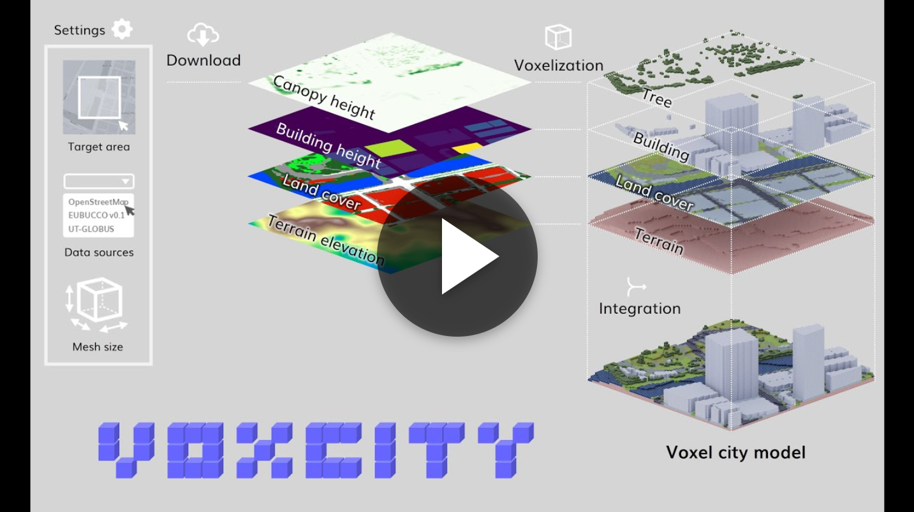

<p align="center">
  
</p>

<p align="center">
  <strong>Generate grid-based 3D city models anywhere on Earth from open geospatial data —<br>then simulate solar, view, and microclimate.</strong>
</p>

<p align="center">
  <a href="https://pypi.python.org/pypi/voxcity"></a>
  <a href="https://pypi.org/project/voxcity/"></a>
  <a href="https://pypi.org/project/voxcity/"></a>
  <a href="https://pepy.tech/project/voxcity"></a>
  <br>
  <a href="https://voxcity.readthedocs.io/en/latest/?badge=latest"></a>
  <a href="https://codecov.io/gh/kunifujiwara/VoxCity"></a>
  <a href="https://doi.org/10.1016/j.compenvurbsys.2025.102366"></a>
  <a href="https://github.com/kunifujiwara/VoxCity/stargazers"></a>
</p>

<p align="center">
  🚀 <a href="https://colab.research.google.com/drive/1Lofd3RawKMr6QuUsamGaF48u2MN0hfrP?usp=sharing">Try in Colab</a> ·
  📖 <a href="https://voxcity.readthedocs.io/en/latest">Docs</a> ·
  🎬 <a href="https://youtu.be/qHusvKB07qk">Video</a> ·
  📄 <a href="https://doi.org/10.1016/j.compenvurbsys.2025.102366">Paper</a> ·
  💬 <a href="https://github.com/kunifujiwara/VoxCity/issues">Issues</a>
</p>

<p align="center">
  
</p>

---

## Table of Contents

- [Why VoxCity?](#why-voxcity)
- [Gallery](#gallery)
- [Quick Start](#quick-start)
- [Installation](#installation)
- [Tutorial](#tutorial)
- [Key Features](#key-features)
- [Usage Guide](#usage-guide)
- [Land Cover Classes](#voxcity-standard-land-cover-classes-used-in-voxel-grids)
- [Data Sources](#references-of-data-sources)
- [Community & Contributing](#community--contributing)
- [Citation](#citation)
- [Credits](#credit)

---

## Why VoxCity?

VoxCity turns open geospatial data into a single, simulation-ready 3D voxel model of any place on Earth — in a few lines of Python.

- 🌍 **Global by default** — automatically selects the best open data source for any location worldwide.
- 🧱 **One integrated voxel model** — buildings, trees, land cover, and terrain fused into a single semantic 3D grid.
- ☀️ **Built-in simulation** — solar irradiance, sky/green view index, landmark visibility, and network analysis.
- 🔄 **Export anywhere** — ENVI-met (INX/EDB), OBJ (Blender/Rhino/Twinmotion), and MagicaVoxel (VOX).
- 🧩 **Reproducible & open** — open data with documented provenance and a peer-reviewed method.

The **generator** module downloads building heights, tree canopy heights, land cover, and terrain elevation for a target area and voxelizes them into an integrated voxel city model. The **simulator** module runs environmental analyses such as solar radiation and view index. Try it in the [Google Colab Demo](https://colab.research.google.com/drive/1Lofd3RawKMr6QuUsamGaF48u2MN0hfrP?usp=sharing) or locally, and see the [documentation](https://voxcity.readthedocs.io/en/latest) for the full API reference and tutorials.

## Gallery

<table align="center">
  <tr>
    <td align="center"><br><sub>☀️ Solar irradiance</sub></td>
    <td align="center"><br><sub>👁️ Sky / Green view index</sub></td>
    <td align="center"><br><sub>🌡️ ENVI-met microclimate</sub></td>
  </tr>
  <tr>
    <td align="center"><br><sub>🏙️ OBJ in Rhino / Blender</sub></td>
    <td align="center"><br><sub>🧊 MagicaVoxel</sub></td>
    <td align="center"><br><sub>🕸️ Network analysis</sub></td>
  </tr>
</table>

## Quick Start

```bash
pip install voxcity   # see Installation for GDAL + Earth Engine setup
```

```python
import ee
from voxcity.generator import get_voxcity

ee.Initialize(project="your-project-id")

# A ~450 m box in Seattle (lon, lat corners)
rectangle_vertices = [
    (-122.3359, 47.5983), (-122.3359, 47.6028),
    (-122.3292, 47.6028), (-122.3292, 47.5983),
]

# Auto-selects the best data sources for the location
voxcity = get_voxcity(rectangle_vertices, meshsize=5)
```

That's it — see the [Usage Guide](#usage-guide) to visualize, export, and simulate your model.

## Installation

Make sure you have Python 3.12 installed. GDAL is the one dependency best installed via conda; everything else comes from pip.

### For Local Environment

```bash
conda create --name voxcity python=3.12
conda activate voxcity
conda install -c conda-forge gdal timezonefinder
pip install voxcity
```

### For Google Colab

```python
!pip install voxcity
```

### Setup for Earth Engine

Many data sources are served through Google Earth Engine. Set up an Earth Engine enabled Cloud Project by following the [official guide](https://developers.google.com/earth-engine/cloud/earthengine_cloud_project_setup), then authenticate:

```bash
# Local environment
earthengine authenticate
```

```python
# Google Colab: click the displayed link, generate a token, then paste it
!earthengine authenticate --auth_mode=notebook
```

## Tutorial

### Google Colab Demos

| Demo | Description | Link |
|------|-------------|------|
| **Basic** | Generate a voxel city model, visualize, and export | <a href="https://colab.research.google.com/drive/1Lofd3RawKMr6QuUsamGaF48u2MN0hfrP?usp=sharing">Open in Colab</a> |
| **ENVI-met Export** | Export a VoxCity model to ENVI-met INX format | <a href="https://colab.research.google.com/drive/1Yv7hMmfEiygCbuz5gPfGmCZyVQnr-8Qn">Open in Colab</a> |

### YouTube Video

- **Walkthrough**: <a href="https://youtu.be/qHusvKB07qk">Watch on YouTube</a>

<p align="center">
  <a href="https://youtu.be/qHusvKB07qk" title="Click to watch the VoxCity tutorial on YouTube">
    
  </a>
</p>

<p align="center">
  <em>Tutorial video by <a href="https://ual.sg/author/xiucheng-liang/">Xiucheng Liang</a></em>
</p>


## Key Features

- **Integration of Multiple Data Sources:**  
  Combines building footprints, land cover data, canopy height maps, and DEMs to generate a consistent 3D voxel representation of an urban scene.
  
- **Flexible Input Sources:**  
  Supports various building and terrain data sources including:
  - Building Footprints: OpenStreetMap, Overture, EUBUCCO, Microsoft Building Footprints, Open Building 2.5D
  - Land Cover: UrbanWatch, OpenEarthMap Japan, ESA WorldCover, ESRI Land Cover, Dynamic World, OpenStreetMap
  - Canopy Height: High Resolution 1m Global Canopy Height Maps, ETH Global Sentinel-2 10m
  - DEM: DeltaDTM, FABDEM, NASA, COPERNICUS, and more

  *Detailed information about each data source can be found in the [References of Data Sources](#references-of-data-sources) section.*
  
- **Customizable Domain and Resolution:**  
  Easily define a target area by drawing a rectangle on a map or specifying center coordinates and dimensions. Adjust the mesh size to meet resolution needs.
  
- **Integration with Earth Engine:**  
  Leverages Google Earth Engine for large-scale geospatial data processing (authentication and project setup required).
  
- **Output Formats:**
  - **ENVI-MET**: Export INX and EDB files suitable for ENVI-MET microclimate simulations.
  - **MagicaVoxel**: Export vox files for 3D editing and visualization in MagicaVoxel.
  - **OBJ**: Export wavefront OBJ for rendering and integration into other workflows.

- **Analytical Tools:**
  - **View Index Simulations**: Compute sky view index (SVI) and green view index (GVI) from a specified viewpoint.
  - **Landmark Visibility Maps**: Assess the visibility of selected landmarks within the voxelized environment.

## Usage Guide

> Authenticate Earth Engine, define an area, generate the model, then export or simulate. The core path is shown open; advanced steps are collapsed.

### 1. Authenticate Earth Engine

```python
import ee
ee.Authenticate()
ee.Initialize(project='your-project-id')
```

### 2. Define Target Area

<details>
<summary>🗺️ Three ways to define your target area (coordinates, draw, or center + size)</summary>

You can define your target area in three ways:

#### Option 1: Direct Coordinate Input
Define the target area by directly specifying the coordinates of the rectangle vertices.

```python
rectangle_vertices = [
    (-122.33587348582083, 47.59830044521263),  # Southwest corner (longitude, latitude)
    (-122.33587348582083, 47.60279755390168),  # Northwest corner (longitude, latitude) 
    (-122.32922451417917, 47.60279755390168),  # Northeast corner (longitude, latitude)
    (-122.32922451417917, 47.59830044521263)   # Southeast corner (longitude, latitude)
]
```

#### Option 2: Draw a Rectangle (for Jupyter Notebook)
Use the GUI map interface to draw a rectangular domain of interest.

```python
from voxcity.geoprocessor.draw import draw_rectangle_map_cityname

cityname = "tokyo"
m, rectangle_vertices = draw_rectangle_map_cityname(cityname, zoom=15)
m
```

#### Option 3: Specify Center and Dimensions (for Jupyter Notebook)
Choose the width and height in meters and select the center point on the map.

```python
from voxcity.geoprocessor.draw import center_location_map_cityname

width = 500
height = 500
m, rectangle_vertices = center_location_map_cityname(cityname, width, height, zoom=15)
m
```
<p align="center">
  
</p>

</details>

### 3. Set Parameters

Define mesh size (required) and optional data sources:

```python
meshsize = 5  # Grid cell size in meters (required)

# Optional: Specify output directory and other settings
kwargs = {
    "output_dir": "output",   # Directory to save output files
    "dem_interpolation": True # Enable DEM interpolation
}
```

### 4. Get voxcity Output

Generate voxel data grids and a corresponding building GeoDataFrame.

#### Option 1: Automatic Mode (Recommended)
Data sources are automatically selected based on location:

```python
from voxcity.generator import get_voxcity

# Auto mode: all data sources selected automatically based on location
voxcity = get_voxcity(
    rectangle_vertices,
    meshsize,
    **kwargs
)
```

#### Option 2: Custom Mode
Specify data sources explicitly:

```python
# Custom mode: specify all data sources
voxcity = get_voxcity(
    rectangle_vertices,
    meshsize,
    building_source='OpenStreetMap',
    land_cover_source='OpenStreetMap',
    canopy_height_source='High Resolution 1m Global Canopy Height Maps',
    dem_source='DeltaDTM',
    **kwargs
)
```

#### Option 3: Hybrid Mode
Specify some sources, auto-select others:

```python
# Hybrid mode: specify building source, auto-select others
voxcity = get_voxcity(
    rectangle_vertices,
    meshsize,
    building_source='Overture',  # Custom
    # land_cover_source, canopy_height_source, dem_source auto-selected
    **kwargs
)
```

### Interactive 3D Demo (Plotly)

- **Open interactive demo**: <a href="https://voxcity.readthedocs.io/en/latest/_static/plotly/voxcity_demo.html">Launch the Plotly 3D viewer</a>

### 5. Exporting Files

Export your model to the format your downstream tool expects — each target is collapsed below.

<details>
<summary>🌡️ ENVI-met (INX/EDB) — microclimate simulation</summary>

#### ENVI-MET INX/EDB Files:
[ENVI-MET](https://www.envi-met.com/) is an advanced microclimate simulation software specialized in modeling urban environments. It simulates the interactions between buildings, vegetation, and various climate parameters like temperature, wind flow, humidity, and radiation. The software is used widely in urban planning, architecture, and environmental studies (Commercial, offers educational licenses).

```python
from voxcity.exporter.envimet import export_inx, generate_edb_file

envimet_kwargs = {
    "output_directory": "output",            # Directory where output files will be saved
    "file_basename": "voxcity",              # Base name (without extension) for INX
    "author_name": "your name",              # Name of the model author
    "model_description": "generated with voxcity",  # Description for the model
    "domain_building_max_height_ratio": 2,   # Max ratio between domain height and tallest building
    "useTelescoping_grid": True,             # Enable telescoping grid
    "verticalStretch": 20,                   # Vertical grid stretching factor (%)
    "min_grids_Z": 20,                       # Minimum number of vertical grid cells
    "lad": 1.0                               # Leaf Area Density (m2/m3) for EDB generation
}

# Optional: specify land cover source used for export (otherwise taken from voxcity.extras when available)
land_cover_source = 'OpenStreetMap'

# Export INX by passing the VoxCity object directly
export_inx(
    voxcity,
    output_directory=envimet_kwargs["output_directory"],
    file_basename=envimet_kwargs["file_basename"],
    land_cover_source=land_cover_source,
    author_name=envimet_kwargs["author_name"],
    model_description=envimet_kwargs["model_description"],
    domain_building_max_height_ratio=envimet_kwargs["domain_building_max_height_ratio"],
    useTelescoping_grid=envimet_kwargs["useTelescoping_grid"],
    verticalStretch=envimet_kwargs["verticalStretch"],
    min_grids_Z=envimet_kwargs["min_grids_Z"],
)

# Generate plant database (EDB) for vegetation
generate_edb_file(lad=envimet_kwargs["lad"])
```
<p align="center">
  
</p>
<p align="center">
  <em>Example Output Exported in INX and Inported in ENVI-met</em>
</p>

</details>

<details>
<summary>🏙️ OBJ — Blender / Rhino / Twinmotion</summary>

#### OBJ Files:

```python
from voxcity.exporter.obj import export_obj

output_directory = "output"  # Directory where output files will be saved
output_file_name = "voxcity" # Base name for the output OBJ file
# Pass the VoxCity object directly (voxel size inferred)
export_obj(voxcity, output_directory, output_file_name)
```
The generated OBJ files can be opened and rendered in the following 3D visualization software:

- [Twinmotion](https://www.twinmotion.com/): Real-time visualization tool (Free for personal use)
- [Blender](https://www.blender.org/): Professional-grade 3D creation suite (Free)
- [Rhino](https://www.rhino3d.com/): Professional 3D modeling software (Commercial, offers educational licenses)

<p align="center">
  
</p>
<p align="center">
  <em>Example Output Exported in OBJ and Rendered in Rhino</em>
</p>

</details>

<details>
<summary>📥 Import Rhino / OBJ buildings into a model</summary>

#### Importing Rhino Models (OBJ):

You can import buildings authored in Rhino into a VoxCity model:

```python
from voxcity.importer import add_buildings_from_obj

voxcity = add_buildings_from_obj(
    voxcity, "design.obj",
    anchor_lonlat=(139.7536, 35.6841),  # world (lon, lat) of the model anchor
    anchor_elevation=12.0,              # world elevation (m) of the anchor
    rotation=0.0, units="m",
)
```

See [docs/guides/rhino_obj_import.md](docs/guides/rhino_obj_import.md) for the full Rhino export guide.

</details>

<details>
<summary>🧊 MagicaVoxel (VOX) — voxel art editor</summary>

#### MagicaVoxel VOX Files:

[MagicaVoxel](https://ephtracy.github.io/) is a lightweight and user-friendly voxel art editor. It allows users to create, edit, and render voxel-based 3D models with an intuitive interface, making it perfect for modifying and visualizing voxelized city models. The software is free and available for Windows and Mac.

```python
from voxcity.exporter.magicavoxel import export_magicavoxel_vox

output_path = "output"
base_filename = "voxcity"
# Pass the VoxCity object directly
export_magicavoxel_vox(voxcity, output_path, base_filename=base_filename)
```
<p align="center">
  
</p>
<p align="center">
  <em>Example Output Exported in VOX and Rendered in MagicaVoxel</em>
</p>

</details>

### 6. Additional Use Cases

Run environmental analyses directly on the generated voxel model. Each is collapsed below.

<details>
<summary>☀️ Solar irradiance (instantaneous & cumulative)</summary>

#### Compute Solar Irradiance:

```python
from voxcity.simulator.solar import get_global_solar_irradiance_using_epw

solar_kwargs = {
    "download_nearest_epw": True,  # Whether to automatically download nearest EPW weather file based on location from Climate.OneBuilding.Org
    # "epw_file_path": "./output/new.york-downtown.manhattan.heli_ny_usa_1.epw",  # Path to EnergyPlus Weather (EPW) file containing climate data. Set if you already have an EPW file.
    "calc_time": "01-01 12:00:00",  # Time for instantaneous calculation in format "MM-DD HH:MM:SS"
    "view_point_height": 1.5,  # Height of view point in meters for calculating solar access. Default: 1.5 m
    "tree_k": 0.6,    # Static extinction coefficient - controls how much sunlight is blocked by trees (higher = more blocking)
    "tree_lad": 1.0,    # Leaf area density of trees - density of leaves/branches that affect shading (higher = denser foliage)
    "colormap": 'magma',       # Matplotlib colormap for visualization. Default: 'viridis'
    "obj_export": True,        # Whether to export results as 3D OBJ file
    "output_directory": 'output/test',  # Directory for saving output files
    "output_file_name": 'instantaneous_solar_irradiance',  # Base filename for outputs (without extension)
    "alpha": 1.0,             # Transparency of visualization (0.0-1.0)
    "vmin": 0,               # Minimum value for colormap scaling in visualization
    # "vmax": 900,             # Maximum value for colormap scaling in visualization
}

# Compute global solar irradiance map (direct + diffuse radiation)
solar_grid = get_global_solar_irradiance_using_epw(
    voxcity,                             # VoxCity object containing voxel data and metadata
    calc_type='instantaneous',           # Calculate instantaneous irradiance at specified time
    direct_normal_irradiance_scaling=1.0, # Scaling factor for direct solar radiation (1.0 = no scaling)
    diffuse_irradiance_scaling=1.0,      # Scaling factor for diffuse solar radiation (1.0 = no scaling)
    **solar_kwargs                       # Pass all the parameters defined above
)

# Adjust parameters for cumulative calculation
solar_kwargs["start_time"] = "01-01 01:00:00" # Start time for cumulative calculation
solar_kwargs["end_time"] = "01-31 23:00:00" # End time for cumulative calculation
solar_kwargs["output_file_name"] = 'cumulative_solar_irradiance'  # Base filename for outputs (without extension)

# Calculate cumulative solar irradiance over the specified time period
cum_solar_grid = get_global_solar_irradiance_using_epw(
    voxcity,                             # VoxCity object containing voxel data and metadata
    calc_type='cumulative',              # Calculate cumulative irradiance over time period instead of instantaneous
    direct_normal_irradiance_scaling=1.0, # Scaling factor for direct solar radiation (1.0 = no scaling)
    diffuse_irradiance_scaling=1.0,      # Scaling factor for diffuse solar radiation (1.0 = no scaling)
    **solar_kwargs                       # Pass all the parameters defined above
)
```

<p align="center">
  
</p>
<p align="center">
  <em>Example Results Saved as OBJ and Rendered in Rhino</em>
</p>

</details>

<details>
<summary>👁️ Green View Index (GVI) & Sky View Index (SVI)</summary>

#### Compute Green View Index (GVI) and Sky View Index (SVI):

```python
from voxcity.simulator.view import get_view_index

view_kwargs = {
    "view_point_height": 1.5,      # Height of observer viewpoint in meters
    "colormap": "viridis",         # Colormap for visualization
    "obj_export": True,            # Whether to export as OBJ file
    "output_directory": "output",  # Directory to save output files
    "output_file_name": "gvi"      # Base filename for outputs
}

# Compute Green View Index using mode='green'
gvi_grid = get_view_index(voxcity, mode='green', **view_kwargs)

# Adjust parameters for Sky View Index
view_kwargs["colormap"] = "BuPu_r"
view_kwargs["output_file_name"] = "svi"
view_kwargs["elevation_min_degrees"] = 0 # Start ray-tracing from the horizon

# Compute Sky View Index using mode='sky'
svi_grid = get_view_index(voxcity, mode='sky', **view_kwargs)
```
<p align="center">
  
</p>
<p align="center">
  <em>Example Results Saved as OBJ and Rendered in Rhino</em>
</p>

</details>

<details>
<summary>🗼 Landmark visibility map</summary>

#### Landmark Visibility Map:

```python
from voxcity.simulator.view import get_landmark_visibility_map

# Dictionary of parameters for landmark visibility analysis
landmark_kwargs = {
    "view_point_height": 1.5,                 # Height of observer viewpoint in meters
    "colormap": "cool",                       # Colormap for visualization
    "obj_export": True,                       # Whether to export as OBJ file
    "output_directory": "output",             # Directory to save output files
    "output_file_name": "landmark_visibility" # Base filename for outputs
}
landmark_vis_map, _ = get_landmark_visibility_map(voxcity, voxcity.extras.get('building_gdf'), **landmark_kwargs)
```
<p align="center">
  
</p>
<p align="center">
  <em>Example Result Saved as OBJ and Rendered in Rhino</em>
</p>

</details>

<details>
<summary>🕸️ Network analysis (map values onto a street network)</summary>

#### Network Analysis:

```python
from voxcity.geoprocessor.network import get_network_values

network_kwargs = {
    "network_type": "walk",        # Type of network to download from OSM (walk, drive, all, etc.)
    "colormap": "magma",          # Matplotlib colormap for visualization
    "vis_graph": True,            # Whether to display the network visualization
    "vmin": 0.0,                  # Minimum value for color scaling
    "vmax": 600000,               # Maximum value for color scaling
    "edge_width": 2,              # Width of network edges in visualization
    "alpha": 0.8,                 # Transparency of network edges
    "zoom": 16                    # Zoom level for basemap
}

G, edge_gdf = get_network_values(
    cum_solar_grid,               # Grid of cumulative solar irradiance values
    rectangle_vertices,           # Coordinates defining simulation domain boundary
    meshsize,                     # Size of each grid cell in meters
    value_name='Cumulative Global Solar Irradiance (W/m²·hour)',  # Label for values in visualization
    **network_kwargs              # Additional visualization and network parameters
)
```

<p align="center">
  
</p>
<p align="center">
  <em>Cumulative Global Solar Irradiance (kW/m²·hour) on Road Network</em>
</p>

</details>

## VoxCity Standard Land Cover Classes (used in voxel grids)

| Index | Class | Index | Class |
|:-----:|-------|:-----:|-------|
| 1 | Bareland | 8 | Mangrove |
| 2 | Rangeland | 9 | Water |
| 3 | Shrub | 10 | Snow and ice |
| 4 | Agriculture land | 11 | Developed space |
| 5 | Tree | 12 | Road |
| 6 | Moss and lichen | 13 | Building |
| 7 | Wet land | 14 | No Data |

## References of Data Sources

VoxCity integrates many open datasets. Expand for full provenance (coverage, resolution, and acquisition).

<details>
<summary>📚 Full data source tables (buildings, canopy height, land cover, terrain)</summary>

### Building 

| Dataset | Spatial Coverage | Source/Data Acquisition |
|---------|------------------|------------------------|
| [OpenStreetMap](https://www.openstreetmap.org) | Worldwide (24% completeness in city centers) | Volunteered / updated continuously |
| [Microsoft Building Footprints](https://github.com/microsoft/GlobalMLBuildingFootprints) | North America, Europe, Australia | Prediction from satellite or aerial imagery / 2018-2019 for majority of the input imagery |
| [Open Buildings 2.5D Temporal Dataset](https://sites.research.google/gr/open-buildings/temporal/) | Africa, Latin America, and South and Southeast Asia | Prediction from satellite imagery / 2016-2023 |
| [EUBUCCO v0.1](https://eubucco.com/) | 27 EU countries and Switzerland (378 regions and 40,829 cities) | OpenStreetMap, government datasets / 2003-2021 (majority is after 2019) |
| [UT-GLOBUS](https://zenodo.org/records/11156602) | Worldwide (more than 1200 cities or locales) | Prediction from building footprints, population, spaceborne nDSM / not provided |
| [Overture Maps](https://overturemaps.org/) | Worldwide | OpenStreetMap, Esri Community Maps Program, Google Open Buildings, etc. / updated continuously |

### Tree Canopy Height

| Dataset | Coverage | Resolution | Source/Data Acquisition |
|---------|-----------|------------|------------------------|
| [High Resolution 1m Global Canopy Height Maps](https://sustainability.atmeta.com/blog/2024/04/22/using-artificial-intelligence-to-map-the-earths-forests/) | Worldwide | 1 m | Prediction from satellite imagery / 2009 and 2020 (80% are 2018-2020) |
| [ETH Global Sentinel-2 10m Canopy Height (2020)](https://langnico.github.io/globalcanopyheight/) | Worldwide | 10 m | Prediction from satellite imagery / 2020 |

### Land Cover

| Dataset | Spatial Coverage | Resolution | Source/Data Acquisition |
|---------|------------------|------------|----------------------|
| [ESA World Cover 10m 2021 V200](https://zenodo.org/records/7254221) | Worldwide | 10 m | Prediction from satellite imagery / 2021 |
| [ESRI 10m Annual Land Cover (2017-2023)](https://www.arcgis.com/home/item.html?id=cfcb7609de5f478eb7666240902d4d3d) | Worldwide | 10 m | Prediction from satellite imagery / 2017-2023 |
| [Dynamic World V1](https://dynamicworld.app) | Worldwide | 10 m | Prediction from satellite imagery / updated continuously |
| [OpenStreetMap](https://www.openstreetmap.org) | Worldwide | - (Vector) | Volunteered / updated continuously |
| [OpenEarthMap Japan](https://www.open-earth-map.org/demo/Japan/leaflet.html) | Japan | ~1 m | Prediction from aerial imagery / 1974-2022 (mostly after 2018 in major cities) |
| [UrbanWatch](https://urbanwatch.charlotte.edu/) | 22 major cities in the US | 1 m | Prediction from aerial imagery / 2014–2017 |

### Terrain Elevation

| Dataset | Coverage | Resolution | Source/Data Acquisition |
|---------|-----------|------------|------------------------|
| [FABDEM](https://doi.org/10.5523/bris.25wfy0f9ukoge2gs7a5mqpq2j7) | Worldwide | 30 m | Correction of Copernicus DEM using canopy height and building footprints data / 2011-2015 (Copernicus DEM) |
| [DeltaDTM](https://gee-community-catalog.org/projects/delta_dtm/) | Worldwide (Only for coastal areas below 10m + mean sea level) | 30 m | Copernicus DEM, spaceborne LiDAR / 2011-2015 (Copernicus DEM) |
| [USGS 3DEP 1m DEM](https://www.usgs.gov/3d-elevation-program) | United States | 1 m | Aerial LiDAR / 2004-2024 (mostly after 2015) |
| [England 1m Composite DTM](https://environment.data.gov.uk/dataset/13787b9a-26a4-4775-8523-806d13af58fc) | England | 1 m | Aerial LiDAR / 2000-2022 |
| [Australian 5M DEM](https://ecat.ga.gov.au/geonetwork/srv/eng/catalog.search#/metadata/89644) | Australia | 5 m | Aerial LiDAR / 2001-2015 |
| [RGE Alti](https://geoservices.ign.fr/rgealti) | France | 1 m | Aerial LiDAR |

</details>

## Community & Contributing

VoxCity is open source and community-driven — contributions of all kinds are welcome.

- 🐛 **Report bugs or request features** via the [issue tracker](https://github.com/kunifujiwara/VoxCity/issues).
- 💬 **Ask questions and share your work** in [Discussions](https://github.com/kunifujiwara/VoxCity/discussions).
- 🤝 **Contribute code** — see [CONTRIBUTING.rst](CONTRIBUTING.rst). To get started:

  ```bash
  git clone https://github.com/kunifujiwara/VoxCity.git
  cd VoxCity
  pip install -r requirements_dev.txt
  pytest
  ```

Please also review our [Code of Conduct](CODE_OF_CONDUCT.rst).

## Citation

Please cite the [paper](https://doi.org/10.1016/j.compenvurbsys.2025.102366) if you use `voxcity` in a scientific publication:

Fujiwara K, Tsurumi R, Kiyono T, Fan Z, Liang X, Lei B, Yap W, Ito K, Biljecki F., 2026. VoxCity: A Seamless Framework for Open Geospatial Data Integration, Grid-Based Semantic 3D City Model Generation, and Urban Environment Simulation. Computers, Environment and Urban Systems, 123, p.102366. https://doi.org/10.1016/j.compenvurbsys.2025.102366

```bibtex
@article{fujiwara2025voxcity,
  title={VoxCity: A Seamless Framework for Open Geospatial Data Integration, Grid-Based Semantic 3D City Model Generation, and Urban Environment Simulation},
  author={Fujiwara, Kunihiko and Tsurumi, Ryuta and Kiyono, Tomoki and Fan, Zicheng and Liang, Xiucheng and Lei, Binyu and Yap, Winston and Ito, Koichi and Biljecki, Filip},
  journal={Computers, Environment and Urban Systems},
  volume = {123},
  pages = {102366},
  year = {2026},
  doi = {10.1016/j.compenvurbsys.2025.102366}
}

```

## Credit

 - Tutorial video by <a href="https://ual.sg/author/xiucheng-liang/">Xiucheng Liang</a>

This package was created with [Cookiecutter](https://github.com/audreyr/cookiecutter) and the [`audreyr/cookiecutter-pypackage`](https://github.com/audreyr/cookiecutter-pypackage) project template.

--------------------------------------------------------------------------------
<br>
<br>
<p align="center">
  <a href="https://ual.sg/">
    
  </a>
</p>

